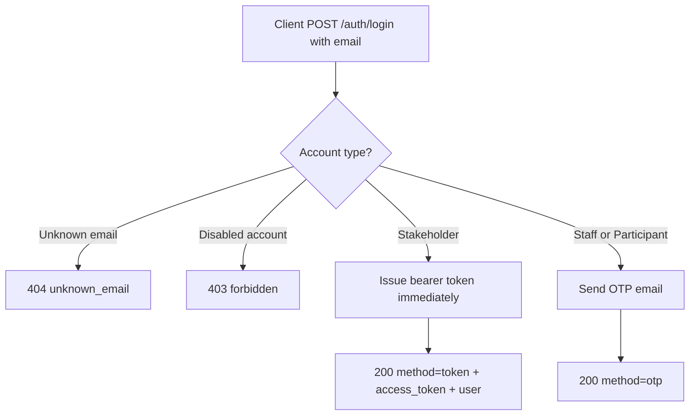
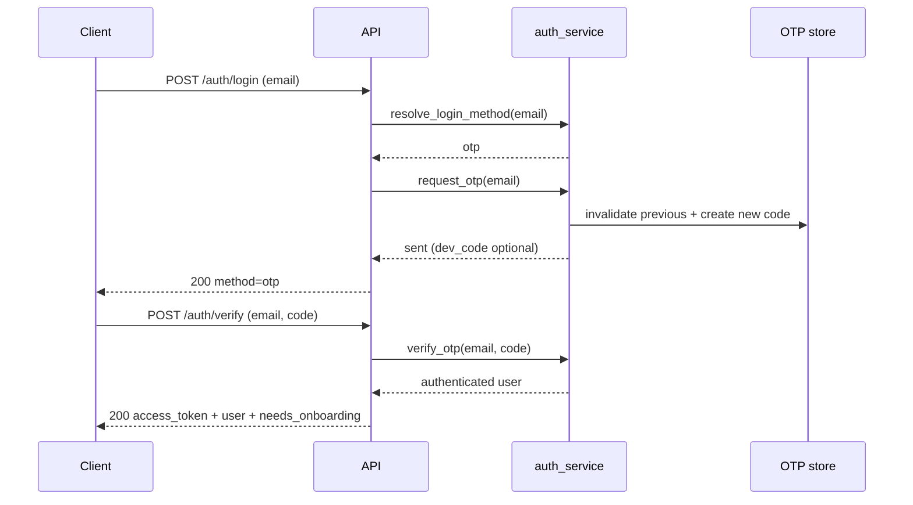
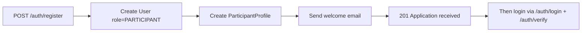
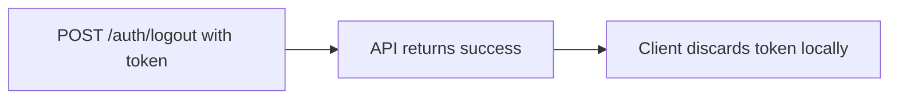
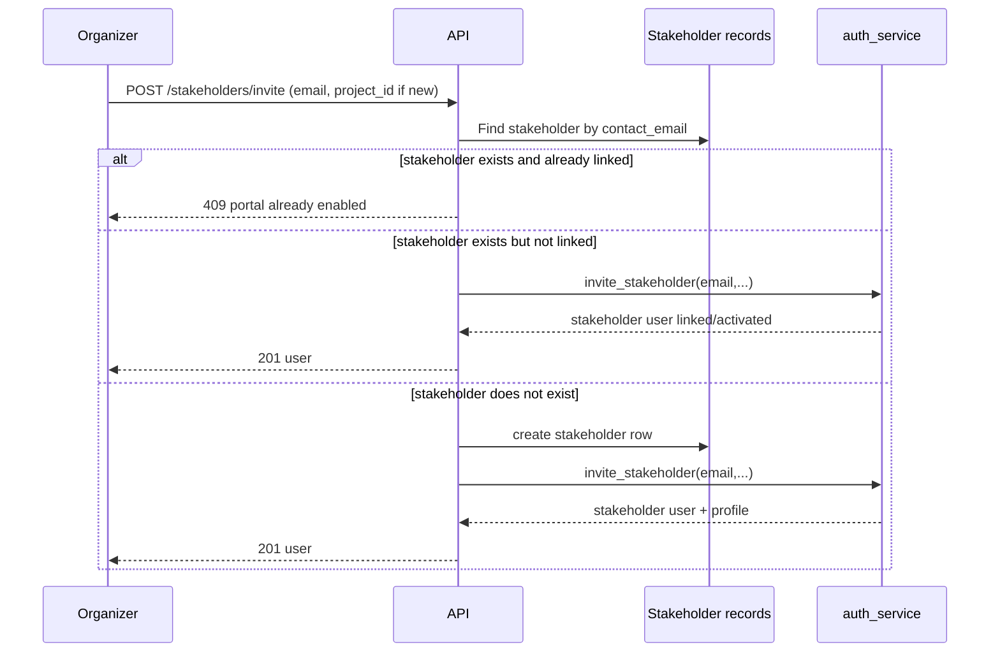
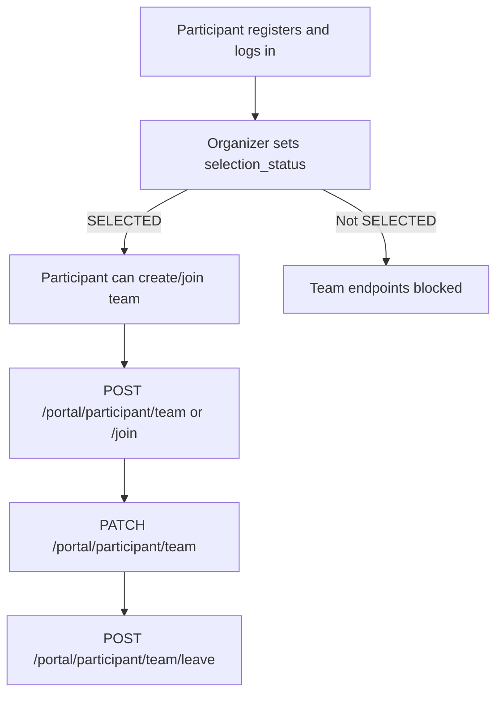
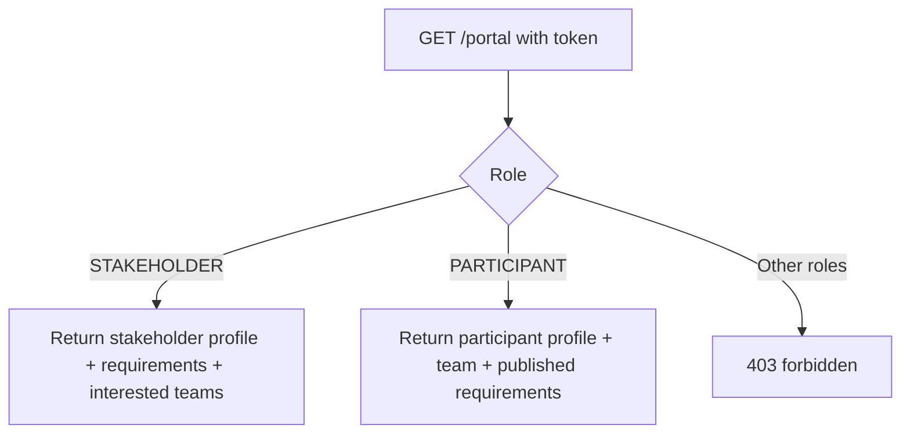

# Hackathon Management API

Comprehensive integration and workflow guide for the versioned external API.

## 1. API at a glance

- Base path: `/api/v1`
- Interactive docs: `GET /api/v1/docs`
- OpenAPI JSON: `GET /api/v1/openapi.json`
- Health check: `GET /api/v1/health`
- API index: `GET /api/v1/`

The API is stateless and token-authenticated. It reuses the same domain services as the first-party web app, so business rules are identical across all clients.

## 2. Security and authentication model

### 2.1 Token model

- Token type: Bearer
- Token format: signed token (itsdangerous serializer)
- Token payload: user id (`uid`)
- Token TTL: `API_TOKEN_TTL_SECONDS` (default 7 days)
- Send token in one of:
  - `Authorization: Bearer <access_token>`
  - `X-API-Token: <access_token>`

### 2.2 Unified login decision flow



### 2.3 OTP verification flow (staff and participants)



### 2.4 Participant registration flow



### 2.5 Stateless logout flow



## 3. Authorization model

Roles:

- `ADMIN`
- `MEMBER`
- `STAKEHOLDER`
- `PARTICIPANT`

Role guards:

- Admin-only: user administration mutations
- Staff-only (`ADMIN`/`MEMBER`): organizer operations, projects, sprints, tasks, stakeholders, documents, community
- Stakeholder-only: stakeholder portal profile and requirements edits
- Participant-only: participant profile/team operations
- Any authenticated user: `/meta`, `/requirements`, `/portal`, `/auth/me`, `/auth/logout`, `/auth/onboarding`
- Public: `/health`, `/`, `/docs`, `/openapi.json`, login/register/verify endpoints

## 4. Response and error contracts

### 4.1 Success envelope

Most responses use:

```json
{
  "ok": true,
  "...": "payload"
}
```

### 4.2 Error envelope

```json
{
  "ok": false,
  "error": "machine_code",
  "message": "human readable detail"
}
```

### 4.3 Common status codes

- `200` success
- `201` created
- `204` CORS preflight response
- `400` validation/shape errors
- `401` missing or invalid token
- `403` role forbidden or disabled account
- `404` resource not found / unknown email
- `405` method not allowed
- `409` business-rule conflict
- `422` domain write failure
- `429` OTP rate-limited

## 5. Key workflow diagrams

### 5.1 Organizer planning flow (epics, sprints, tasks)

```mermaid
flowchart TD
    A[POST /projects] --> B[POST /projects/{id}/sprints]
    B --> C[POST /sprints/{id}/tasks]
    C --> D[POST /tasks/{id}/assign]
    D --> E[POST /tasks/{id}/transition]
    E --> F[POST /tasks/{id}/block]
    E --> G[POST /tasks/{id}/stakeholder]
    F --> H[GET /projects or /bootstrap for refreshed board]
    G --> H
```

### 5.2 Stakeholder account enablement flow



### 5.3 Stakeholder portal requirement lifecycle

```mermaid
flowchart LR
    A[GET /portal as stakeholder] --> B[PATCH /portal/stakeholder/profile]
    B --> C[POST /portal/stakeholder/requirements]
    C --> D[PATCH /portal/stakeholder/requirements/{id}]
    D --> E[DELETE /portal/stakeholder/requirements/{id}]
```

Ownership is enforced server-side: a stakeholder can only mutate requirements linked to their own account.

### 5.4 Participant selection and team formation flow



Key rules enforced by service layer:

- selection cap for `SELECTED` participants
- one-team-per-participant
- max team size (`MAX_TEAM_SIZE`)
- only team lead can edit team

### 5.5 Role-aware portal bootstrap



## 6. Endpoint map (complete)

### 6.1 Public and documentation

| Method | Path | Auth | Purpose |
|---|---|---|---|
| GET | `/api/v1/health` | Public | API and DB health probe |
| GET | `/api/v1/` | Public | API index links |
| GET | `/api/v1/docs` | Public | Swagger UI |
| GET | `/api/v1/openapi.json` | Public | OpenAPI document |

### 6.2 Authentication

| Method | Path | Auth | Purpose |
|---|---|---|---|
| POST | `/api/v1/auth/login` | Public | Start login (stakeholder token or OTP) |
| POST | `/api/v1/auth/request-otp` | Public | Re-send OTP |
| POST | `/api/v1/auth/verify` | Public | OTP exchange for token |
| POST | `/api/v1/auth/register` | Public | Participant signup |
| POST | `/api/v1/auth/onboarding` | Any token | Set username |
| GET | `/api/v1/auth/me` | Any token | Current user profile |
| POST | `/api/v1/auth/logout` | Any token | Stateless logout ack |

### 6.3 Workspace and metadata

| Method | Path | Auth | Purpose |
|---|---|---|---|
| GET | `/api/v1/meta` | Any token | Enum/reference metadata + caps |
| GET | `/api/v1/bootstrap` | Staff | Organizer snapshot (projects/users/docs) |

### 6.4 Users (organizer accounts)

| Method | Path | Auth | Purpose |
|---|---|---|---|
| GET | `/api/v1/users` | Staff | List users |
| POST | `/api/v1/users` | Admin | Invite organizer |
| PATCH/PUT | `/api/v1/users/{user_id}` | Admin | Update role/status/profile fields |
| DELETE | `/api/v1/users/{user_id}` | Admin | Remove user (last-admin guarded) |

### 6.5 Epics (projects)

| Method | Path | Auth | Purpose |
|---|---|---|---|
| GET | `/api/v1/projects` | Staff | List projects with children |
| POST | `/api/v1/projects` | Staff | Create project |
| GET | `/api/v1/projects/{project_id}` | Staff | Get project |
| PATCH/PUT | `/api/v1/projects/{project_id}` | Staff | Update project |
| DELETE | `/api/v1/projects/{project_id}` | Staff | Delete project |

### 6.6 Sprints

| Method | Path | Auth | Purpose |
|---|---|---|---|
| POST | `/api/v1/projects/{project_id}/sprints` | Staff | Create sprint |
| PATCH/PUT | `/api/v1/sprints/{sprint_id}` | Staff | Update sprint |
| DELETE | `/api/v1/sprints/{sprint_id}` | Staff | Delete sprint |

### 6.7 Tasks

| Method | Path | Auth | Purpose |
|---|---|---|---|
| POST | `/api/v1/sprints/{sprint_id}/tasks` | Staff | Create task |
| GET | `/api/v1/tasks/{task_id}` | Staff | Get task |
| PATCH/PUT | `/api/v1/tasks/{task_id}` | Staff | Update task |
| DELETE | `/api/v1/tasks/{task_id}` | Staff | Delete task |
| POST | `/api/v1/tasks/{task_id}/assign` | Staff | Assign one or many users |
| POST | `/api/v1/tasks/{task_id}/transition` | Staff | Move task state |
| POST | `/api/v1/tasks/{task_id}/block` | Staff | Block/unblock with reason |
| POST | `/api/v1/tasks/{task_id}/stakeholder` | Staff | Link stakeholder to task |

### 6.8 Stakeholders

| Method | Path | Auth | Purpose |
|---|---|---|---|
| POST | `/api/v1/projects/{project_id}/stakeholders` | Staff | Create stakeholder in project |
| PATCH/PUT | `/api/v1/stakeholders/{stakeholder_id}` | Staff | Update stakeholder |
| DELETE | `/api/v1/stakeholders/{stakeholder_id}` | Staff | Delete stakeholder |
| GET | `/api/v1/stakeholders/{stakeholder_id}/tasks` | Staff | Tasks linked to stakeholder |
| POST | `/api/v1/stakeholders/invite` | Staff | Enable/create stakeholder portal account |

### 6.9 Documents

| Method | Path | Auth | Purpose |
|---|---|---|---|
| GET | `/api/v1/documents` | Staff | List docs |
| POST | `/api/v1/documents` | Staff | Create doc |
| GET | `/api/v1/documents/{doc_id}` | Staff | Get doc |
| PATCH/PUT | `/api/v1/documents/{doc_id}` | Staff | Update doc |
| DELETE | `/api/v1/documents/{doc_id}` | Staff | Delete doc |

Note: API documents resource uses `/documents` so Swagger UI can remain at `/docs`.

### 6.10 Community oversight

| Method | Path | Auth | Purpose |
|---|---|---|---|
| GET | `/api/v1/community` | Staff | Full community snapshot |
| GET | `/api/v1/participants` | Staff | List participants |
| PATCH/PUT | `/api/v1/participants/{profile_id}` | Staff | Set selection status / interview notes |
| GET | `/api/v1/teams` | Staff | List teams |

### 6.11 Requirement catalog

| Method | Path | Auth | Purpose |
|---|---|---|---|
| GET | `/api/v1/requirements` | Any token | Published requirement list |

### 6.12 Portal endpoints

| Method | Path | Auth | Purpose |
|---|---|---|---|
| GET | `/api/v1/portal` | Stakeholder or Participant | Role-aware bootstrap |
| PATCH/PUT | `/api/v1/portal/stakeholder/profile` | Stakeholder | Update own profile |
| POST | `/api/v1/portal/stakeholder/requirements` | Stakeholder | Create requirement |
| PATCH/PUT | `/api/v1/portal/stakeholder/requirements/{requirement_id}` | Stakeholder | Update own requirement |
| DELETE | `/api/v1/portal/stakeholder/requirements/{requirement_id}` | Stakeholder | Delete own requirement |
| PATCH/PUT | `/api/v1/portal/participant/profile` | Participant | Update own profile |
| POST | `/api/v1/portal/participant/team` | Participant | Create team |
| PATCH/PUT | `/api/v1/portal/participant/team` | Participant | Update own team (lead only) |
| POST | `/api/v1/portal/participant/team/join` | Participant | Join team by code |
| POST | `/api/v1/portal/participant/team/leave` | Participant | Leave current team |

## 7. Integration playbooks

### 7.1 Organizer front-facing app startup

1. `POST /auth/login` with organizer email.
2. `POST /auth/verify` with OTP.
3. Store token securely.
4. `GET /meta` for enums, states, caps.
5. `GET /bootstrap` for initial board snapshot.
6. Use domain endpoints (`/projects`, `/tasks`, `/community`, etc.) for mutations.

### 7.2 Stakeholder-facing app startup

1. `POST /auth/login` with stakeholder email.
2. Receive token directly.
3. `GET /portal` for profile + requirements + interested teams.
4. Use stakeholder portal endpoints to manage profile and problem statements.

### 7.3 Participant-facing app startup

1. New user: `POST /auth/register`.
2. Sign in via OTP (`/auth/login` then `/auth/verify`).
3. `GET /portal` for profile, requirement catalog, and current team state.
4. Update profile, then create/join/leave team as selection status allows.

## 8. CORS and deployment notes

- CORS allow-origin is controlled by `API_CORS_ORIGINS`.
- Allowed methods: `GET, POST, PATCH, PUT, DELETE, OPTIONS`.
- Allowed headers include `Authorization`, `Content-Type`, and `X-API-Token`.
- Preflight requests are handled with HTTP 204.

## 9. Troubleshooting quick guide

- `401 unauthorized`: token missing, expired, malformed, or not sent in expected header.
- `403 forbidden`: wrong role for endpoint or account disabled.
- `404 not_found`: wrong id, unknown email, or ownership check failed.
- `409 conflict`: business constraints (last admin, selection cap, team constraints).
- `429 rate_limited`: OTP requested too frequently.

## 10. Recommended client structure

- Maintain one API client module that injects bearer token.
- Keep role-aware routing in front-end app by calling `GET /portal` or `GET /auth/me` first.
- Prefer Swagger (`/api/v1/docs`) for request-body schema examples and quick endpoint testing.
